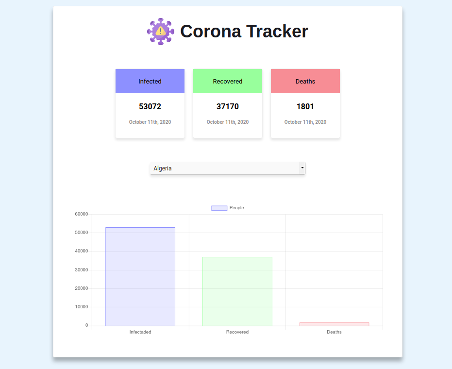

# Corona Tracker

This is an application that show up the actual number of Covid-19 cases. I did it just to practice [ReactJS](https://reactjs.org/)




## Installation

To use the app you must have [npm](https://nodejs.org/) or [yarn](https://yarnpkg.com/) installed in your machine.

```bash
npm install && npm start
```